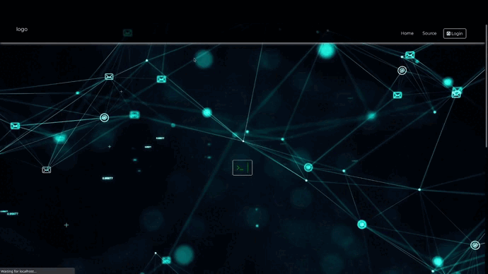
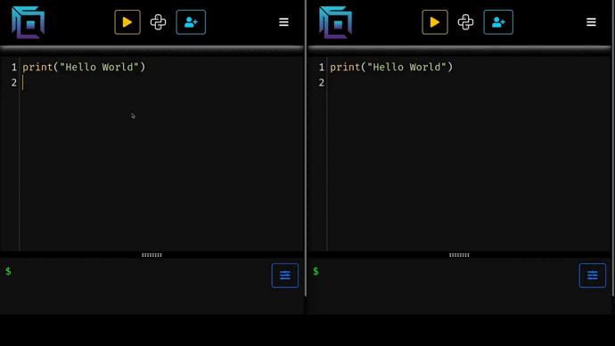

<h1 align="center"> Realtime Collaborative Code Editor </h1>


<p align="center">


</p>

Share and collaborate on your code with developers anywhere.

## Check it out!
The application is live [here](https://bocks-editor.uaenorth.cloudapp.azure.com)

## Features:
* Supported Languages: 
    * C/C++
    * Python
    * JavaScript
* Real Time Collaboration despite network latency
* Sharing is as simple as sharing a link
* Pick up from where you left off
* Backup all the files you have been working on
* Dark Theme
* Sublime Text Key binds integrated
* Responsive Design suitable for Desktop, Tablets and Mobile

## Demo:

### Landing Page:


### Live Sync



## Build:

### Prerequisites 
You must have the following installed on your machine
* [Node JS - v14.0 LTS](https://nodejs.org/en/download/)
* [npm - Node Package Manager - v6.14](https://nodejs.org/en/download/)

#### Configure the .env 
The application would need

* `PORT` (defaults to 3000)  
* `MONGO_URI` 
* `SESS_SECRET`
* `GITHUB_CLIENT_ID` 
* `GITHUB_CLIENT_SECRET` 
<br />
<br />


Clone the repository by running

```bash
git clone https://github.com/ShaderOX/live-editor.git && cd live-editor 
```

Installs the required packages
```bash
npm install 
```

Builds the release JavaScript file
```bash
npm run build
```


variables in order to access the database and support Github Authentication.

Next, run 
```bash
npm start
```
and open http://localhost:3000 to access the running application

## LICENSE
[LICENSE](./LICENSE)

## Code of Conduct 
[Code of Conduct.md](./docs/CODE_OF_CONDUCT.md)
